# Autonomous Operations Command Center 
Preview: https://grid-operations-agent.vercel.app/

### At a Glance

This application is more than a dashboard; it's an interactive supervisor for a team of AI agents. It starts by pulling a dynamic feed of potential anomalies, ranging from physical equipment malfunctions to software errors. A user can dispatch an agent to investigate any of these events with a single click. The UI then visualizes the agent's entire thought process in real-time as a fluid, animated timeline. You can watch as the agent reasons about the problem, uses an intelligent LLM-powered router to select the best tool for the job, and performs a hybrid search to gather context from both relevant historical events and the most recent, user-submitted field reports. The system is designed with a complete feedback loop, allowing users to inject new information through live maintenance logs, which immediately updates the agent's knowledge base and influences its future conclusions.

---
## 🛠️ Tech Stack & Architecture

This project utilizes a modern, end-to-end stack, from a reactive frontend to a powerful agentic backend.

<div>
  
  
  
  
  
  
  
  
  
</div>

- **Frontend:**
  - **Framework:** React (Vite)
  - **Styling:** Tailwind CSS
  - **Animation:** Framer Motion
  - **Icons:** Lucide React, React-Icons
  - **Live Data Streaming:** `@microsoft/fetch-event-source` (for SSE)

- **Backend:**
  - **Framework:** Flask
  - **WSGI Server:** Gunicorn
  - **Cloud SDK:** Boto3 (for AWS S3)

- **AI & Data Processing:**
  - **Orchestration:** LangChain & LangGraph
  - **LLM:** Google Gemini Pro / Flash
  - **Vector Database:** Faiss (Facebook AI Similarity Search)
  - **Embeddings:** Sentence-Transformers
  - **Data Handling:** Pandas

- **Deployment & Infrastructure:**
  - **Frontend Hosting:** Vercel
  - **Backend Hosting:** Render
  - **Data Storage:** AWS S3
  - **Environment:** Docker (for building Lambda layers)


### Architectural Highlights

- **Server-Sent Events (SSE):** The Flask backend streams the agent's step-by-step progress to the React frontend for a live, responsive user experience.
- **Hybrid RAG:** The agent's retrieval strategy combines semantic vector search with a recency bias, allowing it to use both the most relevant historical data and the latest user-submitted information.
- **Intelligent Tool Routing:** A dedicated LangGraph node uses an LLM call to analyze the anomaly and intelligently select the most logical tool, making the agent's behavior dynamic and context-aware.
- **Lazy Loading:** AI models and knowledge base files are loaded on-demand ("lazy loaded") in the backend to ensure fast server startup times and efficient resource management.

## ⚙️ Development Workflow & Methodology

This project was built using an iterative, feature-driven lifecycle. Each phase built upon the last, creating a robust and polished application from a simple prototype. The process is visualized below, showing the flow from initial concept to final deployment.

```mermaid
graph LR
    subgraph Legend
        direction LR
        A1(💡 Core Idea) --> B1(🏗️ Backend Dev) --> C1(🎨 Frontend Dev) --> D1(🔗 Integration) --> E1(🚀 Deployment)
    end
```


Phase 1: Conception & Core Prototyping. The project began by establishing a clear problem statement and building a minimal viable product (MVP)—a standalone Python agent capable of analyzing data. This validated the core AI logic before any UI was developed.

Phase 2: Agentic Architecture. The initial prototype was evolved into a sophisticated, multi-tool agent using LangGraph. This phase focused on developing the agent's reasoning capabilities, its RAG-based knowledge system, and its ability to use specialized tools.

Phase 3: UI/UX & Frontend Development. With a robust backend in place, the focus shifted to creating a polished user experience. The frontend was built in React, with a strong emphasis on a clean, Apple-inspired aesthetic, fluid animations, and clear data visualization.

Phase 4: Real-Time Integration. The frontend and backend were connected to create a complete feedback loop. This involved implementing a streaming API (SSE) and enabling the agent's knowledge base to be updated in real-time based on user input, making the system truly dynamic.

Phase 5: Deployment & Documentation. The final phase involved deploying the frontend and backend to production environments (Vercel and Render) and creating comprehensive documentation. The use of Git for version control and the CI/CD capabilities of the hosting platforms allowed for seamless updates.

## 🚀 How to Run Locally
```bash
**1. Clone the Repository:**

git clone [https://github.com/your-username/your-repo-name.git](https://github.com/your-username/your-repo-name.git)
cd your-repo-name

2. Setup the Backend:

Navigate to the backend folder: cd backend

Create and activate a Python virtual environment:

Bash

python -m venv venv
# On Windows PowerShell
.\venv\Scripts\Activate.ps1
Install all required packages:

Bash

pip install -r requirements.txt
Create your knowledge base files by running the builder scripts:

Bash

python build_log_kb.py
python 2_create_knowledge_base.py
Start the Flask server:

Bash

flask --app app run
3. Setup the Frontend:

Open a new terminal and navigate to the root project folder.

Install npm packages:

Bash

npm install
Start the React development server:

Bash

npm run dev
4. Configuration:

Add your API keys for Gemini and OpenWeatherMap in the agent_logic.py and App.jsx files, respectively.

Ensure your AWS credentials are set up for the data ingestion script.

Your Autonomous Operations Command Center will be running at http://localhost:5175
